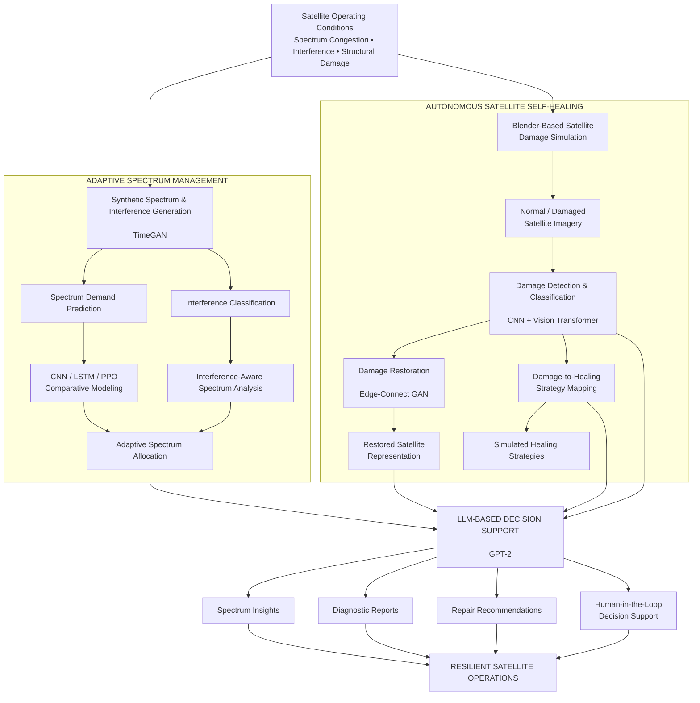

# Generative AI-Driven Self-Healing and Adaptive Spectrum Management for Resilient Satellite Communications

> **Best Paper Award** — collaborative research project by **Pullela Vaishnavi Kiran** and **Pullela Giridhar**.

A research prototype integrating adaptive spectrum management, satellite damage detection and restoration, self-healing strategy selection, and LLM-based decision support for resilient satellite communications.

[](#)
[](#)
[](#)
[](#)
[](#)

## Overview

Satellite communication systems can experience spectrum congestion, interference, and structural degradation caused by radiation, thermal cycling, mechanical stress, and component failure. This project develops a unified AI-driven framework addressing **adaptive spectrum management and autonomous satellite self-healing within a single research pipeline**.

The framework combines synthetic spectrum/interference generation, demand prediction, interference classification, satellite damage detection, damage restoration, damage-to-healing strategy mapping, and LLM-based decision support. The work was evaluated in simulation using synthetic datasets and Blender-generated satellite imagery.

## System Architecture



## Adaptive Spectrum Management

### Synthetic data generation

A **TimeGAN-based framework** generates synthetic spectrum-demand and interference sequences while preserving temporal dependencies through embedding, recovery, generator, discriminator, and supervisor components.

### Demand prediction and allocation

The study compares GAN-based generation, PPO, LSTM, and CNN approaches for spectrum-demand modeling and allocation. Reported experiments identify the CNN model as the strongest performer among the tested prediction approaches.

### Interference classification

A CNN-based classifier processes temporal and spatial interference features to identify interference patterns and support spectrum-allocation analysis.

### Spectrum scarcity analysis

The framework evaluates spectrum management under availability levels from **50% to 100%**, explicitly studying degraded-spectrum conditions.

## Satellite Self-Healing

The self-healing pipeline models structural degradation using synthetic satellite imagery generated in Blender.

### Damage dataset

The study reports **15,000 images** for binary damage classification and a separate **2,250-image multiclass dataset** covering nine damage classes: cracks, dents, and thermal degradation, each at low, medium, and high severity.

### Damage restoration

**Edge-Connect GAN** is used for edge prediction and reconstruction of damaged image regions.

### Damage classification

A hybrid **CNN + Vision Transformer** architecture combines convolutional feature extraction with Transformer encoders to classify damage type and severity.

### Damage-to-healing mapping

A feed-forward network maps classified damage modes to corresponding simulated self-healing strategies, including:

- Electrostatic crack sealing
- Plasma deposition
- Laser ablation
- Thermal expansion
- Electromagnetic stress redistribution
- Laser resurfacing
- AI-triggered self-healing ceramic sprays
- AI-directed cold welding
- AI-directed thermal-shock repair

These are **simulated strategy mappings in the research framework**, not claims of a deployed physical repair system.

## LLM Decision Support

GPT-2-based components provide natural-language interpretation of spectrum conditions and satellite diagnostics, supporting report generation, repair recommendations, confidence interpretation, and human-in-the-loop decision support.

## Reported Results

The following values are **reported by the accompanying research work** and are not presented as fresh reproduction benchmarks:

| Component | Reported result |
|---|---:|
| Spectrum demand prediction (CNN) | **75–85% accuracy** |
| Interference classification (CNN) | **98% accuracy** |
| Edge-Connect GAN restoration | **0.92 SSIM** |
| CNN + Transformer damage classification | **99.70% accuracy** |
| CNN + Transformer precision | **99.65%** |
| CNN + Transformer recall | **99.60%** |
| Damage-to-healing mapping | **95% correct over 100 simulated scenarios** |

The reported spectrum-allocation evaluation covers 50–100% availability and measures both accuracy and utilization under spectrum scarcity.

## Implementation Map

| Area | Main implementation files |
|---|---|
| Synthetic spectrum/interference generation | `data_gen_gan_spectrum_allocation.py`, `data_gen_gan_interference.py` |
| Demand prediction | `GAN_spectrum_demand_prediction.py`, `spectrum_demand_forecast.py`, `spectrum_demand_forecast_cnn.py` |
| PPO spectrum allocation | `spectrum_allocation_ppo.py` |
| Interference classification | `interference_classifier.py` |
| Damage classification | `evaluate_cnn_model.py`, `make_cnn_prediction.py` |
| Image restoration | `edge_connect_gan.py`, `reconstruction_gan_model.py` |
| End-to-end integration | `integration_new.py` |
| Dashboard / decision support | `spectrum_satellite_dashboard.py`, `telecom_chatbot.py` |
| Evaluation and reporting | `evaluate_damaged_satellite_scenario.py`, `report_generator.py`, `run_report_service.py` |

The repository intentionally retains separate experimental scripts where they represent distinct model families, evaluation stages, or interfaces. The superseded duplicate `integration.py` implementation has been removed in favor of `integration_new.py`.

## Experimental Scope and Limitations

The current framework is validated using **synthetic data and Blender-based simulation**, rather than live satellite telemetry or operational spacecraft hardware. The healing strategies are simulated mappings within the research framework and should not be interpreted as demonstrated physical spacecraft repair capabilities.

Future work includes validation against public ESA/NASA datasets, hardware-oriented experimentation, and optimization for radiation-hardened deployment.

## Repository Structure

```text
.
├── docs/                    # Reproducibility, research scope, roadmap
├── research/                # Research notes and supporting material
├── *.py                    # Model, training, evaluation, integration scripts
├── requirements.txt
├── .env.example
├── .gitignore
├── SECURITY.md
├── CONTRIBUTORS.md
└── README.md
```

## Security and Configuration

Never commit API keys, credentials, service-account files, private datasets, or local model checkpoints. Use `.env.example` as the configuration template and review `SECURITY.md` before running integrations.

## Attribution

This is a **collaborative research project**. The repository is maintained under **Pullela Vaishnavi Kiran's GitHub account** as a portfolio and reproducibility artifact. This repository does not claim sole authorship of the underlying work. See `CONTRIBUTORS.md` for contribution attribution.

## Publication / Award

The work received a **Best Paper Award**. Formal publication metadata and DOI will be added when the final bibliographic record is available.

## Authors

- **Pullela Vaishnavi Kiran**
- **Pullela Giridhar**

For formal academic attribution, use the final publication record when available.
