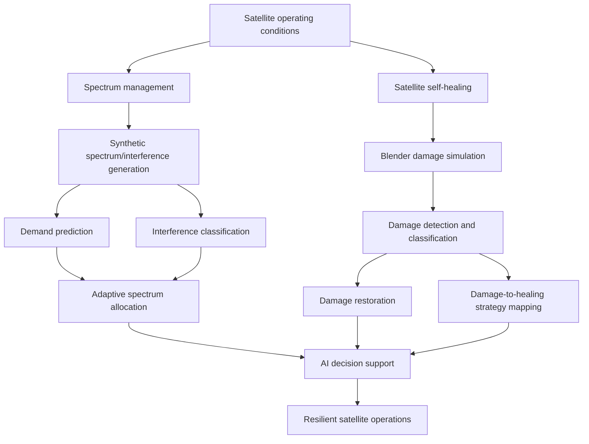

# Generative AI-Driven Self-Healing and Adaptive Spectrum Management for Resilient Satellite Communications

> Collaborative research prototype by Pullela Vaishnavi and Pullela Giridhar.

This project develops an AI-driven framework for resilient satellite communications by combining **adaptive spectrum management, interference detection, satellite damage classification, damage restoration, damage-to-healing strategy mapping, and LLM-based decision support** in a simulated environment.

## System Overview



## Technical Components

### Adaptive spectrum management

- TimeGAN-based synthetic spectrum-demand and interference sequence generation.
- Comparative spectrum-demand modeling using CNN, LSTM, and PPO approaches.
- CNN-based interference classification.
- Spectrum-allocation evaluation under availability levels from 50% to 100%.

### Satellite damage assessment and restoration

- Blender-generated satellite imagery for controlled damage scenarios.
- CNN + Vision Transformer architecture for damage type and severity classification.
- Edge-Connect GAN for reconstruction of damaged image regions.
- Mapping of detected damage modes to simulated self-healing strategies.

### Decision support

GPT-2-based components provide natural-language interpretation of spectrum conditions and satellite diagnostics, including repair recommendations and human-in-the-loop decision support.

## Repository Structure

```text
├── data_gen_gan_interference.py
├── data_gen_gan_spectrum_allocation.py
├── GAN_spectrum_demand_prediction.py
├── spectrum_demand_forecast.py
├── spectrum_demand_forecast_cnn.py
├── spectrum_allocation_ppo.py
├── interference_classifier.py
├── evaluate_cnn_model.py
├── evaluate_damaged_satellite_scenario.py
├── reconstruction_gan_model.py
├── make_cnn_prediction.py
├── integration.py
├── integration_new.py
├── research/
└── docs/
```

## Reported Results

The following values are **reported in the associated research work** and are not presented as newly reproduced benchmarks by this repository:

| Component | Reported result |
|---|---:|
| Spectrum demand prediction (CNN) | **75–85% accuracy** |
| Interference classification (CNN) | **98% accuracy** |
| Edge-Connect GAN restoration | **0.92 SSIM** |
| CNN + Vision Transformer damage classification | **99.70% accuracy** |
| Damage classification precision | **99.65%** |
| Damage classification recall | **99.60%** |
| Damage-to-healing mapping | **95% over 100 simulated scenarios** |

## Experimental Scope

The framework is validated using **synthetic data, simulation, and Blender-generated satellite imagery**, rather than live spacecraft telemetry or operational satellite hardware. The healing strategies are simulated mappings within the research framework and should not be interpreted as demonstrated physical spacecraft repair capabilities.

Future work includes validation against public ESA/NASA datasets, hardware-oriented experimentation, and optimization for deployment constraints.

## Research Areas

- Resilient satellite communications
- Autonomous satellite self-healing
- Adaptive spectrum management
- Generative AI
- Reinforcement learning
- Computer vision
- Vision Transformers
- GAN-based image restoration
- AI-assisted decision support

## Attribution

This is a **collaborative project**. The repository is maintained under Pullela Vaishnavi's GitHub account to document her contribution and provide a public research portfolio artifact. Collaborative authorship and original research attribution are retained rather than presenting the work as an individual project.

## Security and Configuration

Do not commit credentials, API keys, generated local artifacts, or private datasets. Use `.env.example` as the configuration template and review `SECURITY.md` before running integrations.

## Publication

The associated work received a **Best Paper Award**. Formal publication metadata and DOI will be added when the final bibliographic record is available.
